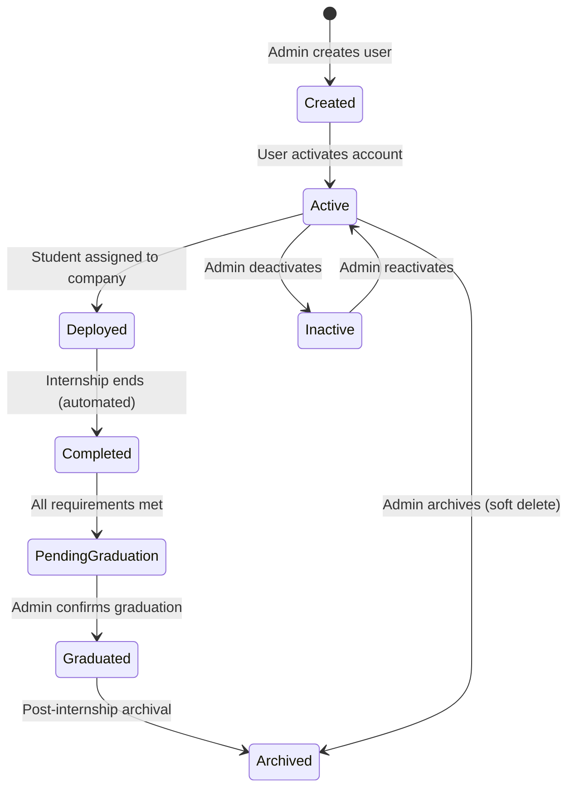
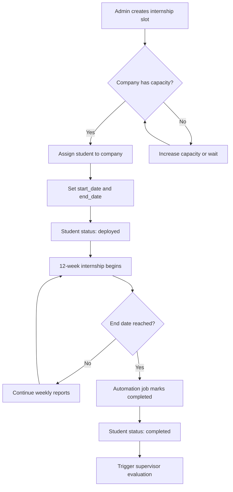
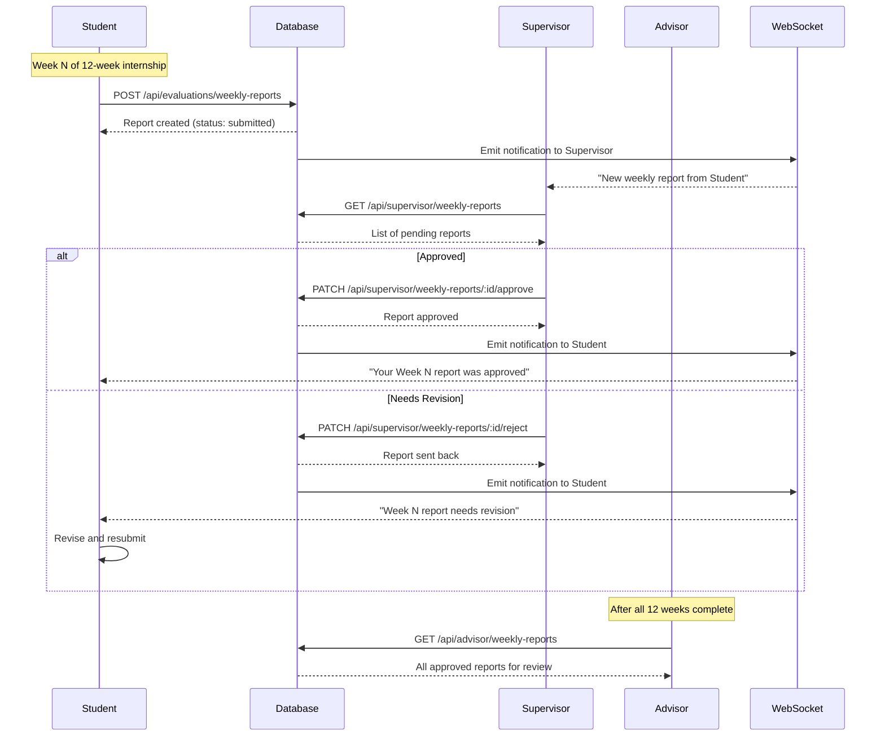
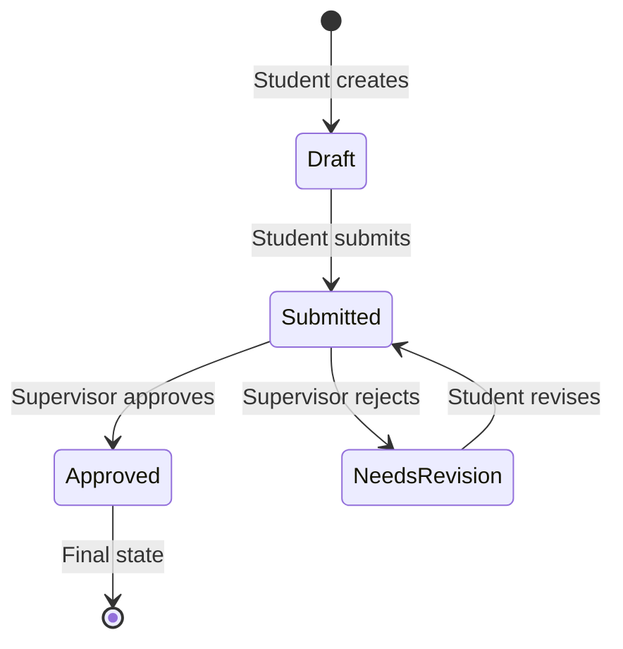
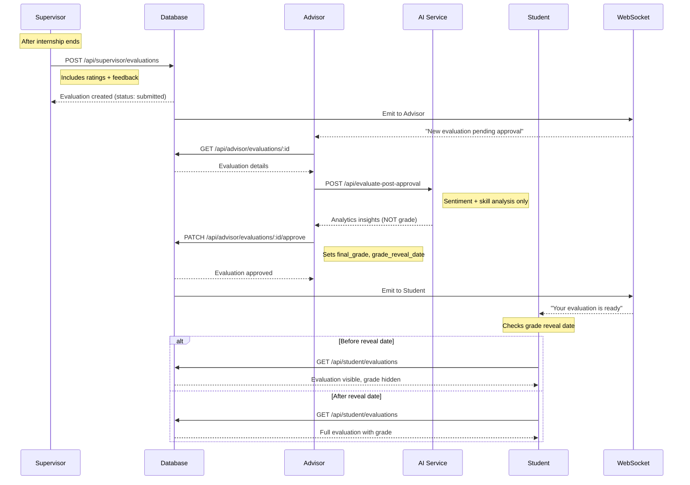
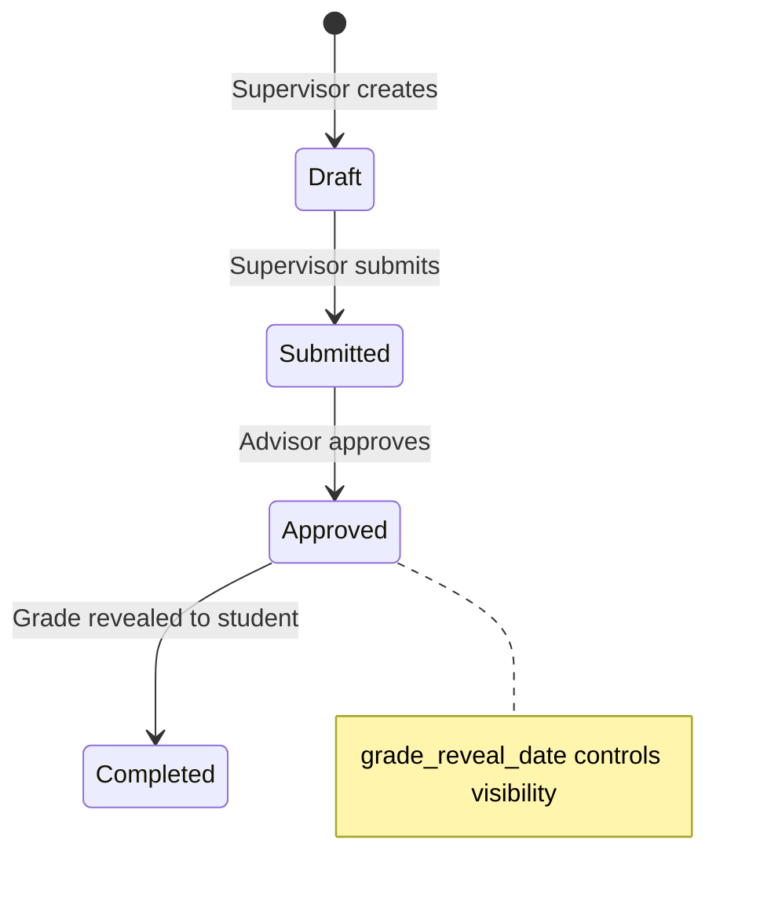
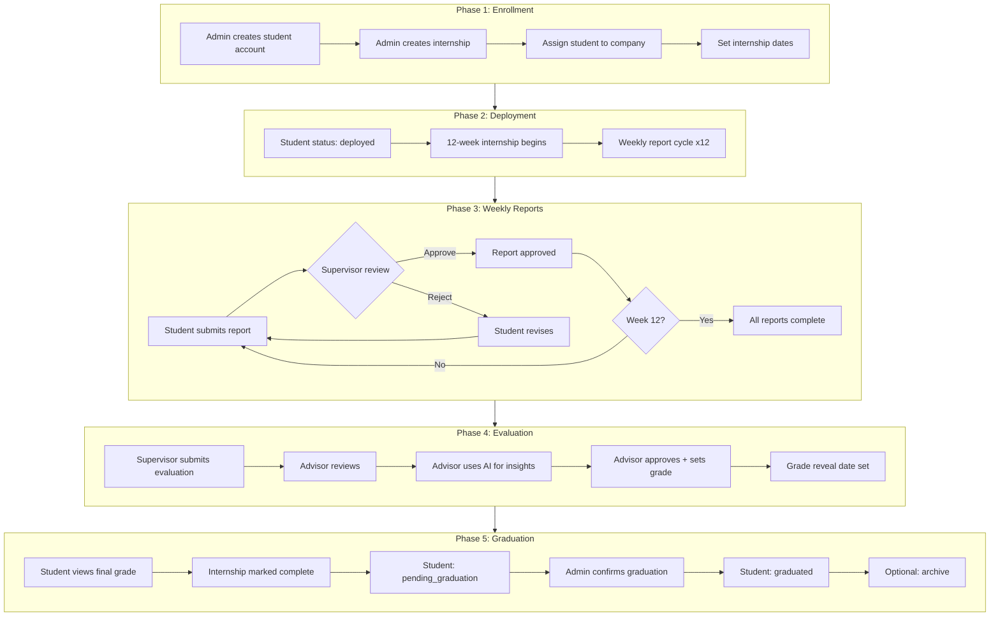
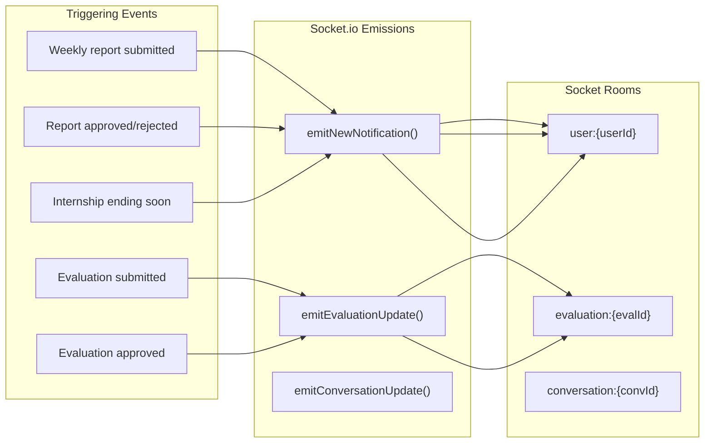
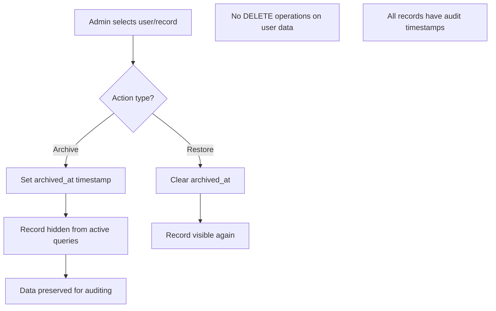
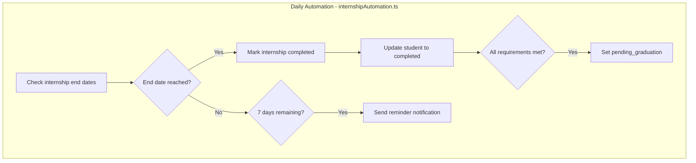

# Internship Platform - Complete Transaction Flow

## Overview

This document provides a complete visual representation of all transaction flows in the Intern-Galing Platform, addressing the thesis advisor requirement for **"Complete transaction flow should be visible"**.

---

## 1. User Lifecycle Flow



### User Status State Machine

| Status | Description | Allowed Transitions |
|--------|-------------|---------------------|
| `created` | Account created, not yet activated | → `active` |
| `active` | Normal active user | → `deployed`, `inactive`, `archived` |
| `deployed` | Student assigned to internship company | → `completed`, `inactive` |
| `completed` | Internship finished | → `pending_graduation` |
| `pending_graduation` | Awaiting admin graduation confirmation | → `graduated` |
| `graduated` | Successfully completed internship program | → `archived` |
| `inactive` | Temporarily deactivated | → `active` |
| `archived` | Soft-deleted, data preserved | Terminal state |

---

## 2. Internship Assignment Flow



### Company Capacity Management

- **Total Capacity**: Maximum students a company can accept
- **Current Interns**: Active students deployed to company
- **Utilization**: `(current_interns / total_capacity) * 100%`
- **Available Slots**: `total_capacity - current_interns`

---

## 3. Weekly Report Submission Flow (Student → Supervisor → Advisor)



### Weekly Report Status Flow



---

## 4. Evaluation & Grading Flow



### Evaluation Status Flow



### AI Service Role (Analytics Only, NOT Grading)

The AI service is used **exclusively for analytics and insights**, not for determining grades:

| AI Endpoint | Purpose | Used By |
|-------------|---------|---------|
| `/api/evaluate` | Sentiment analysis + skill extraction | Admin analytics |
| `/api/evaluate-with-bias` | Enhanced sentiment + bias detection | Admin analytics |
| `/api/evaluate-post-approval` | Post-approval insights | Advisor review |
| `/api/batch-evaluate` | Batch historical analysis | Admin reports |

**Important**: Final grades are determined by:
1. Supervisor ratings (technical, communication, work_ethic)
2. Advisor professional judgment
3. Advisor can override with `grade_override` + `grade_override_reason`

---

## 5. Complete End-to-End Flow



---

## 6. Notification Flow



---

## 7. Data Archival Flow (No Deletion)

Per thesis advisor requirement: **"Archive instead of delete para may integrity yung data"**



### Archived Data Queries

```sql
-- Active records only
SELECT * FROM users WHERE archived_at IS NULL;

-- Include archived for reports
SELECT * FROM users;

-- Archived only for admin review
SELECT * FROM users WHERE archived_at IS NOT NULL;
```

---

## 8. Automation Jobs



### Automation Schedule

| Job | Schedule | Description |
|-----|----------|-------------|
| `checkInternshipEndDates` | Daily 00:00 | Marks completed internships |
| `sendInternshipReminders` | Daily 08:00 | 7-day end reminders |
| `updatePendingGraduation` | Daily 00:00 | Status transitions |

---

## 9. API Endpoint Reference by Flow

### Student Endpoints
| Endpoint | Method | Purpose |
|----------|--------|---------|
| `/api/student/weekly-reports` | POST | Submit weekly report |
| `/api/student/weekly-reports` | GET | View own reports |
| `/api/student/evaluations` | GET | View final evaluation |

### Supervisor Endpoints
| Endpoint | Method | Purpose |
|----------|--------|---------|
| `/api/supervisor/weekly-reports` | GET | View pending reports |
| `/api/supervisor/weekly-reports/:id/approve` | PATCH | Approve report |
| `/api/supervisor/weekly-reports/:id/reject` | PATCH | Request revision |
| `/api/supervisor/evaluations` | POST | Submit final evaluation |

### Advisor Endpoints
| Endpoint | Method | Purpose |
|----------|--------|---------|
| `/api/advisor/weekly-reports` | GET | View all approved reports |
| `/api/advisor/evaluations` | GET | View pending evaluations |
| `/api/advisor/evaluations/:id/approve` | PATCH | Approve + set grade |

### Admin Endpoints
| Endpoint | Method | Purpose |
|----------|--------|---------|
| `/api/admin/users` | GET/POST | User management |
| `/api/admin/users/:id/graduate` | POST | Confirm graduation |
| `/api/admin/dashboard/company-capacity` | GET | Company utilization |
| `/api/admin/analytics` | GET | Platform metrics |

---

## 10. Summary: Thesis Advisor Requirements Addressed

| Requirement | Implementation |
|-------------|----------------|
| ✅ Dashboard shows OJT data | Company capacity, internship stats, student deployment |
| ✅ Archive instead of delete | `archived_at` timestamps, no hard deletes |
| ✅ Weekly report flow | Student → Supervisor approval → Advisor visibility |
| ✅ AI for analytics only | Post-approval insights, not grading decisions |
| ✅ Complete transaction flow visible | This document with Mermaid diagrams |

---

*Generated for Intern-Galing Platform - CVSU OJT Management System*
